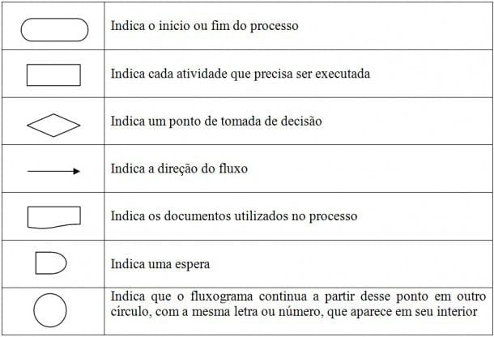
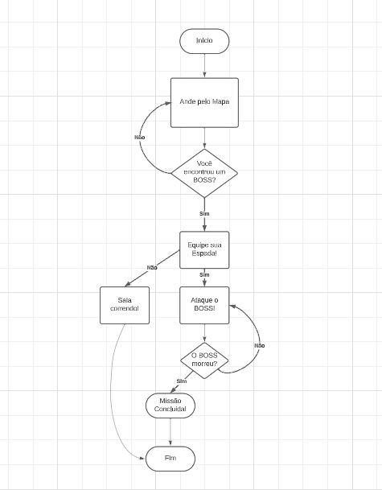

## 02 - Fluxogramas

O fluxograma é um "método" de qualidade utilizada para representar a sequência lógica de para resolução de um problema por meio de símbolos gráficos. Os símbolos proporcionam uma melhor visualização do funcionamento do processo, ajudando no seu entendimento e tornando a descrição do processo mais visual e intuitiva.

**Símbolos do Fluxograma**

**Benefícios do Fluxograma**

- Melhora a compreensão do processo de trabalho;
- Mostra os passos necessários para a solução do problema;
- Pode ser utilizado para encontrar falhas no processo;
- Facilita a consulta em caso de dúvidas sobre o processo.

Lembra o exemplo de Algoritmo que eu falei no tópico anterior?
>**2 -** Pense em um jogo aonde um herói está a um passo do inimigo e precisa acertá-lo, para isso é preciso fazer uma sequência logica.

Segue o fluxograma que elaborei para ele:

Para fixar assista o vídeo abaixo.

## 🔗 Referências

 - [Vídeo sobre Algoritmo e Fluxograma](https://www.youtube.com/watch?v=ojD5Q6E8xW4)

## 💻 Conteúdos
<table align="center">
    <tr align="center">
      <th>Matéria</th>
      <th>Link de acesso</th>
    </tr>
  <tbody align="left">
    <tr>
      <td>02 - Fluxogramas</td>
      <td align="center">
        
      </td>
    </tr>
      <tr>
      <td>Lógica de Programação</td>
      <td align="center">
        
      </td>
    </tr>
    
  </tbody>
</table>